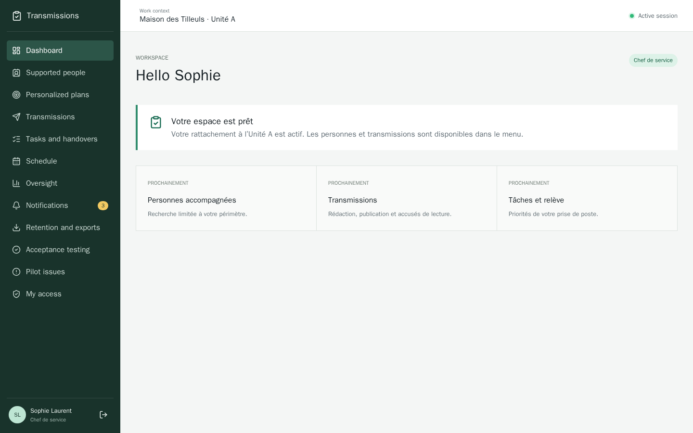
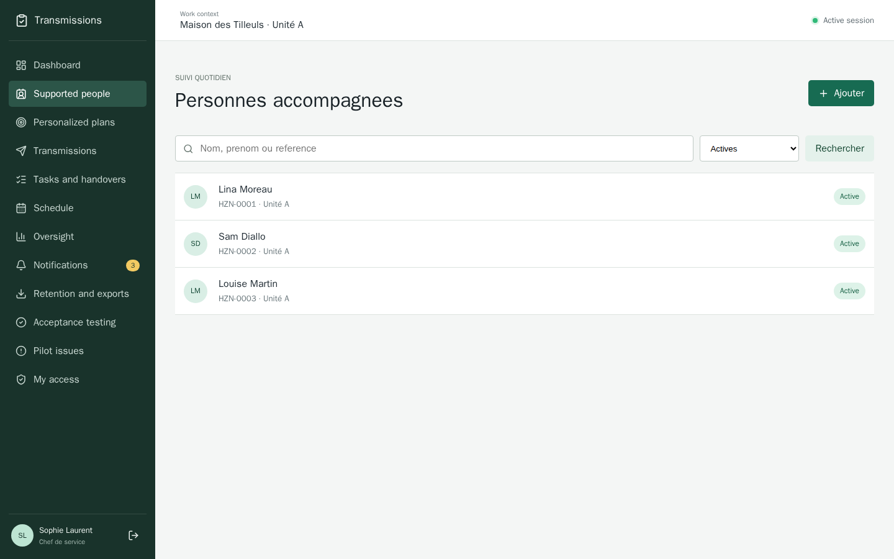
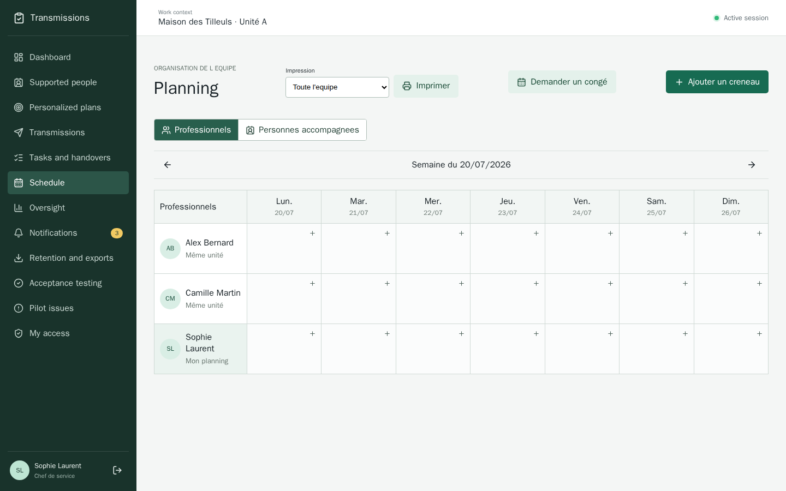
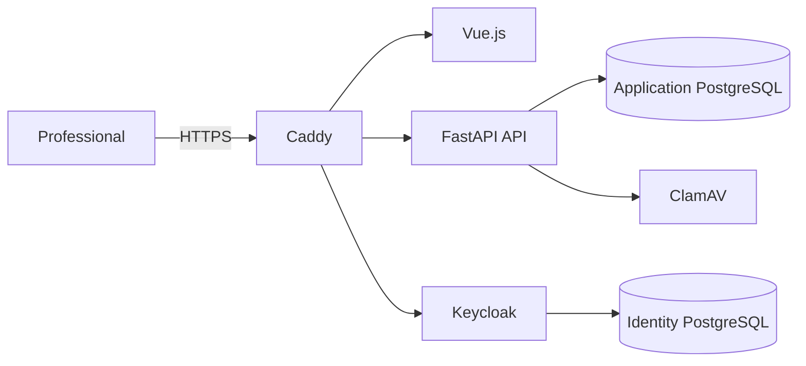

<p align="right">
  
</p>

# Transmissions

**A secure, open-source and self-hostable coordination platform for social care and
medico-social teams. Designed in France.**

[](LICENSE)


Transmissions brings essential care information into one workspace: targeted handover notes,
tasks, shift handovers, staff and supported-person schedules, personalized support plans,
notifications and operational indicators. Permissions are enforced by the backend according to
each professional's role and organizational scope.

The project was designed in France for the needs of French social and medico-social
organizations, with particular attention to the principles of the French Act of 2 January 2002
on social and medico-social services and to personalized support planning.

> [!IMPORTANT]
> This repository provides a technical and functional foundation. Deployment with real data
> requires validation by the responsible organization, including a DPIA, retention policy,
> suitable hosting, operating procedures, risk management and business acceptance testing.
> This project does not constitute legal advice or security certification.

## Application Preview

The screenshots below were generated from the local evaluation profile with entirely fictional
people and records. No production or personal data is included.

### Team Dashboard



### Supported People



### Shared Schedule



## Features

| Area | Capabilities |
| --- | --- |
| Identity and access | Keycloak authentication, individual sessions, administrator, service manager and professional roles, unit-based assignments |
| Supported people | Scope-restricted records, creation limited to service managers and administrators, traceable archiving |
| Handover notes | Drafts, versioned publishing, importance levels, scanned attachments and read confirmation for users other than the author |
| Tasks and shift handovers | Assignment, deadlines, priorities, progress tracking and prepared handover summaries |
| Shared schedules | Separate calendars for professionals and supported people, working hours, leave, events, invitations and group outings |
| Personalized support plans | Expectations, needs, goals, consent, versions, reviews and links to scheduled support activities |
| Oversight | Activity indicators, alerts, workload monitoring, pilot readiness and pilot issue tracking |
| Operations | Audited exports, retention policies, encrypted backups, restore exercises and production checks |
| Interface | Responsive, printable and accessible UI, with a French/English preference for navigation and permanent interface elements |

## How It Works

Transmissions is installed inside the organization and accessed through a web browser. The local
administrator activates the organization, creates individual staff accounts and assigns each
person a role and one or more units. Service managers maintain the directory of supported people,
while professionals record and share only the information available within their authorized
scope.

Daily work is organized around the dashboard, handover notes, tasks and separate calendars for
staff and supported people. Scheduled activities can bring several professionals and supported
people together, and can be linked to goals in a personalized support plan. Sensitive actions are
audited, and printable views support meetings and day-to-day communication without replacing the
organization's own governance procedures.

## Architecture



- **Frontend:** Vue 3, TypeScript and Vite
- **Backend:** FastAPI, SQLAlchemy and Alembic on Python 3.13
- **Identity:** Keycloak with OIDC and BFF sessions
- **Data:** PostgreSQL with application-level encryption for sensitive fields
- **Files:** ClamAV scanning before attachments are made available
- **HTTPS entry point:** Caddy with local development certificates and ACME in production
- **Deployment:** Docker Compose with separate development and production images

## Install on Debian 13

Use a dedicated Debian 13 server or virtual machine with at least 4 CPU cores, 8 GB of memory and
40 GB of free disk space. Internet access is required during installation; Docker and Compose are
installed automatically if necessary.

Download the installer and run it as root. These are all the commands required:

```bash
curl --proto '=https' --tlsv1.2 -fsSLo transmy-install.sh \
  https://raw.githubusercontent.com/transmy-spec/Transmy/newest/packaging/debian/install-from-github.sh
sudo sh transmy-install.sh
```

The script verifies Debian, builds the release candidate locally, installs the package and opens
the guided setup. Local mode is selected automatically after 15 seconds and uses the private IP
address detected on the server. The assistant creates installation-specific secrets, initializes
Keycloak, starts the production stack and schedules encrypted daily backups. Organization,
establishment, service and unit names are completed later in the administration interface. The
installer also prints the one-time activation link for the first administrator.

The installer is deliberately downloaded before execution so it can be reviewed locally. A
signed APT repository will replace this source-based bootstrap after the signing and publication
process has been completed. See the [Debian 13 installation guide](docs/11-installation-debian.md)
for network, TLS and operational details.

After installation, routine administration is performed with `sudo transmy status`,
`sudo transmy doctor`, `sudo transmy backup` and `sudo transmy upgrade`.

## Development Setup

### Requirements

- Docker Desktop, or Docker Engine with Docker Compose v2;
- Git.

### Local Environment

After cloning the repository, open its directory and prepare the local configuration:

```bash
cp .env.example .env
```

Replace every `CHANGE_ME` value in `.env` with a long, random local secret. The initial
interface language can also be selected during installation:

```dotenv
VITE_DEFAULT_LOCALE=fr
```

Start the environment:

```bash
docker compose config
docker compose up --build -d --wait
```

Open **[https://localhost](https://localhost)**. The certificate generated locally by Caddy
should only be trusted for this development environment.

### Initial Accounts

The Debian installer prints a one-time local activation link for the organization administrator.
The administrator chooses their password directly through that link; no permanent administrator
password is displayed or sent by Transmy. A root operator can revoke previous links and issue a
two-hour recovery link with:

```bash
sudo transmy admin-reset
```

The Debian installer defaults to the production profile: it creates no generic business account,
no fictional care record and no credentials file. An explicit `evaluation` profile may create
fictional temporary accounts whose generated credentials are available only to `root` in
`/var/lib/transmy/initial-credentials.txt`. See the
[Debian installation guide](docs/11-installation-debian.md) for the complete procedure.

## Quality Checks

The project includes backend, frontend, security and load checks:

```bash
# Backend
docker compose run --rm api ruff check .
docker compose run --rm api mypy app
docker compose run --rm api pytest

# Frontend
docker compose run --rm frontend npm run lint
docker compose run --rm frontend npm run test:run
docker compose run --rm frontend npm run build

# Local HTTP security checks and pilot load test
docker compose --profile validation run --rm security-audit
docker compose --profile validation run --rm load-test
```

Current reference baseline: **81 backend tests**, **3 frontend tests**, more than **90% backend
coverage**, a successful HTTP security audit and a pilot load test with no failed request.

## Backup and Restore

Backups cover both the application and Keycloak databases. Archives are encrypted before being
stored in their dedicated Docker volume.

```bash
docker compose --profile operations run --rm backup
docker compose --profile operations run --rm restore-test
```

A backup should only be considered usable after a successful restore exercise. The detailed
procedure is available in [Production Operations](docs/10-exploitation-production.md).

## Production

`compose.production.yaml` enables minimal images, read-only filesystems, reduced Linux
capabilities and the production HTTPS configuration.

```bash
docker compose \
  -f compose.yaml \
  -f compose.production.yaml \
  config
```

Before any real-world deployment, review the
[operations guide](docs/10-exploitation-production.md) and the
[threat model](docs/05-modele-de-menaces.md).

## Security and Privacy

- no telemetry or mandatory cloud dependency;
- authorization enforced by the API independently of frontend visibility;
- separate public, application and identity networks;
- encryption of sensitive fields and backup archives;
- audit records for sensitive operations;
- CSRF protection, secure session cookies and origin validation;
- no real data, backup, export or secret should ever be committed to this repository.

Do not disclose a vulnerability in a public issue. Follow the process described in
[SECURITY.md](SECURITY.md).

## Documentation

The detailed project documentation is currently maintained in French, reflecting its initial
deployment context.

| Document | Scope |
| --- | --- |
| [Users and journeys](docs/01-utilisateurs-et-parcours.md) | User profiles, needs and main workflows |
| [Requirements](docs/02-exigences.md) | Functional and non-functional requirements |
| [Data model](docs/03-modele-de-donnees.md) | Entities and business rules |
| [Architecture](docs/04-architecture.md) | Application and infrastructure architecture |
| [Threat model](docs/05-modele-de-menaces.md) | Threats, controls and residual risks |
| [Pilot readiness](docs/07-preparation-pilote.md) | Acceptance and go-live conditions |
| [Personalized support plan](docs/09-projet-personnalise.md) | Functional framework for personalized support planning |
| [Operations](docs/10-exploitation-production.md) | Deployment, backup, restore and incident procedures |
| [Debian 13 installation](docs/11-installation-debian.md) | Package, guided setup and system administration |
| [Production release candidate](docs/12-release-candidate-production.md) | Technical evidence and external approval gates |

The complete index is available in the [docs](docs/README.md) directory.

## Contributing

Contributions are welcome. Before proposing a change, read
[CONTRIBUTING.md](CONTRIBUTING.md), add appropriate tests and make sure that no sensitive data
or secret appears in the changes.

## License

This project is licensed under the **GNU Affero General Public License v3.0**.
See [LICENSE](LICENSE) for the full license text.
