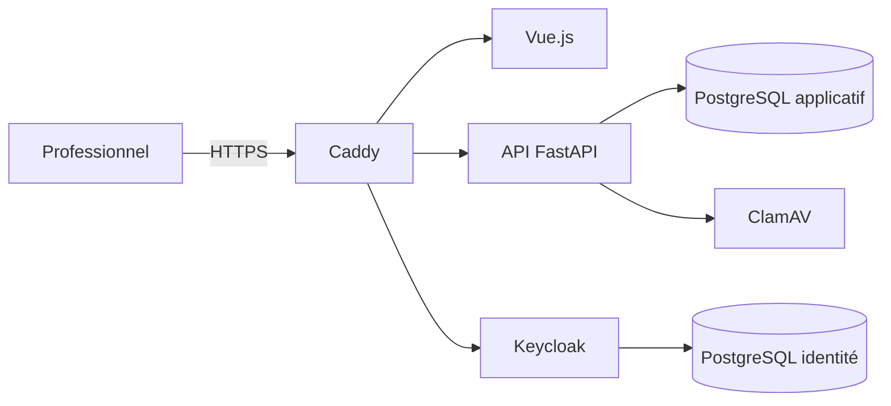

# Transmissions

**Une application open source, auto-hébergeable et sécurisée pour les équipes du secteur social et médico-social.**

[](LICENSE)


Transmissions rassemble dans un même espace les informations utiles à l'accompagnement :
transmissions ciblées, tâches, relèves, plannings d'équipe et des personnes accompagnées,
projets personnalisés, notifications et pilotage. Les droits sont contrôlés côté serveur selon
le rôle et le périmètre organisationnel de chaque professionnel.

> [!IMPORTANT]
> Le dépôt fournit un socle technique et fonctionnel. Son déploiement avec des données réelles
> nécessite une validation par l'organisme responsable : AIPD, politique de conservation,
> hébergement approprié, procédures d'exploitation, gestion des risques et recette métier.

## Fonctionnalités

| Domaine | Ce que l'application permet |
| --- | --- |
| Identité et accès | Authentification Keycloak, sessions individuelles, rôles administrateur, chef de service et professionnel, rattachements par unité |
| Personnes accompagnées | Dossiers synthétiques limités au périmètre autorisé, création réservée au chef de service et à l'administrateur, archivage traçable |
| Transmissions | Brouillons, publication versionnée, niveaux d'importance, pièces jointes analysées, confirmation de lecture hors auteur |
| Tâches et relèves | Attribution, échéances, priorités, suivi d'avancement et préparation des relèves |
| Planning partagé | Calendriers distincts des professionnels et des personnes accompagnées, horaires, congés, événements, invitations et sorties de groupe |
| Projet personnalisé | Attentes, besoins, objectifs, consentement, versions, revues et liens avec les accompagnements planifiés |
| Pilotage | Indicateurs d'activité, alertes, suivi de charge, préparation et anomalies du pilote |
| Exploitation | Exports audités, politiques de conservation, sauvegardes chiffrées, exercice de restauration et contrôles de production |
| Interface | Responsive, imprimable, accessible, préférence Français/English pour la navigation et les éléments permanents |

## Aperçu technique



- **Frontend :** Vue 3, TypeScript et Vite
- **Backend :** FastAPI, SQLAlchemy et Alembic sur Python 3.13
- **Identité :** Keycloak avec flux OIDC et sessions BFF
- **Données :** PostgreSQL, champs sensibles chiffrés au niveau applicatif
- **Fichiers :** contrôle antivirus ClamAV avant utilisation
- **Entrée HTTPS :** Caddy, certificats locaux en développement et ACME en production
- **Déploiement :** Docker Compose, images de développement et de production séparées

## Démarrage rapide

### Prérequis

- Docker Desktop, ou Docker Engine avec Docker Compose v2 ;
- Git.

### Installation locale

Après avoir cloné le dépôt, placez-vous dans son dossier puis préparez la configuration :

```bash
cp .env.example .env
```

Remplacez ensuite chaque valeur `CHANGE_ME` dans `.env` par un secret local long et aléatoire.
Vous pouvez également définir la langue initiale de l'interface :

```dotenv
VITE_DEFAULT_LOCALE=fr
```

Lancez l'environnement :

```bash
docker compose config
docker compose up --build -d --wait
```

Ouvrez **[https://localhost](https://localhost)**. Le certificat généré localement par Caddy
doit être accepté uniquement pour cet environnement de développement.

### Comptes de démonstration

| Profil | Identifiant | Mot de passe |
| --- | --- | --- |
| Administrateur | `admin` | `Admin-Local-2026!` |
| Chef de service | `chefservice` | `Chef-Local-2026!` |
| Professionnel | `professionnel` | `Pro-Local-2026!` |

Ces comptes et toutes les données fournies sont fictifs. **Ne les utilisez jamais en production.**

## Vérifications

Le projet dispose de contrôles backend, frontend, sécurité et charge :

```bash
# Backend
docker compose run --rm api ruff check .
docker compose run --rm api mypy app
docker compose run --rm api pytest

# Frontend
docker compose run --rm frontend npm run lint
docker compose run --rm frontend npm run test:run
docker compose run --rm frontend npm run build

# Contrôles HTTP et test de charge local
docker compose --profile validation run --rm security-audit
docker compose --profile validation run --rm load-test
```

État de référence actuel : **72 tests backend**, **3 tests frontend**, couverture backend
supérieure à **90 %**, audit HTTP réussi et test de charge pilote sans requête en échec.

## Sauvegarde et restauration

Les sauvegardes couvrent les bases applicative et Keycloak. Elles sont chiffrées avant leur
stockage dans le volume Docker dédié.

```bash
docker compose --profile operations run --rm backup
docker compose --profile operations run --rm restore-test
```

Une archive ne doit être considérée comme exploitable qu'après un exercice de restauration
réussi. La procédure détaillée se trouve dans
[Exploitation en production](docs/10-exploitation-production.md).

## Production

Le fichier `compose.production.yaml` active les images minimales, les systèmes de fichiers en
lecture seule, la réduction des capacités Linux et la configuration HTTPS de production.

```bash
docker compose \
  -f compose.yaml \
  -f compose.production.yaml \
  config
```

Avant tout déploiement réel, consultez la
[procédure d'exploitation](docs/10-exploitation-production.md) et le
[modèle de menaces](docs/05-modele-de-menaces.md).

## Sécurité et confidentialité

- aucune télémétrie ni dépendance cloud obligatoire ;
- autorisations vérifiées par l'API, indépendamment de l'affichage frontend ;
- séparation des réseaux publics, applicatifs et d'identité ;
- chiffrement des champs sensibles et des sauvegardes ;
- journalisation des opérations sensibles ;
- protection CSRF, cookies de session sécurisés et validation de l'origine ;
- aucune donnée réelle, sauvegarde, export ou secret ne doit être ajouté au dépôt.

Une vulnérabilité ne doit pas être publiée dans une issue publique. Suivez la procédure décrite
dans [SECURITY.md](SECURITY.md).

## Documentation

| Document | Contenu |
| --- | --- |
| [Utilisateurs et parcours](docs/01-utilisateurs-et-parcours.md) | Profils, besoins et parcours principaux |
| [Exigences](docs/02-exigences.md) | Exigences fonctionnelles et non fonctionnelles |
| [Modèle de données](docs/03-modele-de-donnees.md) | Entités et règles de gestion |
| [Architecture](docs/04-architecture.md) | Architecture applicative et infrastructure |
| [Modèle de menaces](docs/05-modele-de-menaces.md) | Menaces, mesures et risques résiduels |
| [Préparation du pilote](docs/07-preparation-pilote.md) | Conditions de recette et de mise en service |
| [Projet personnalisé](docs/09-projet-personnalise.md) | Cadre fonctionnel du projet personnalisé d'accompagnement |
| [Exploitation](docs/10-exploitation-production.md) | Déploiement, sauvegarde, restauration et incidents |

L'index complet est disponible dans le dossier [docs](docs/README.md).

## Contribuer

Les contributions sont les bienvenues. Avant de proposer une modification, consultez
[CONTRIBUTING.md](CONTRIBUTING.md), ajoutez les tests adaptés et vérifiez qu'aucune donnée
sensible ni aucun secret n'apparaît dans les changements.

## Licence

Ce projet est distribué sous licence **GNU Affero General Public License v3.0**.
Consultez [LICENSE](LICENSE) pour le texte complet.
